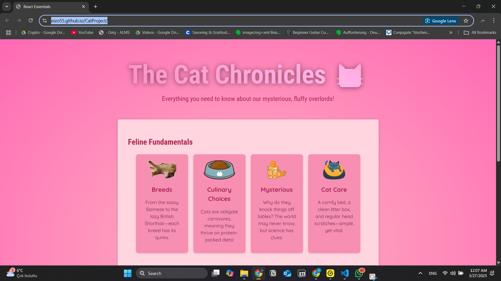
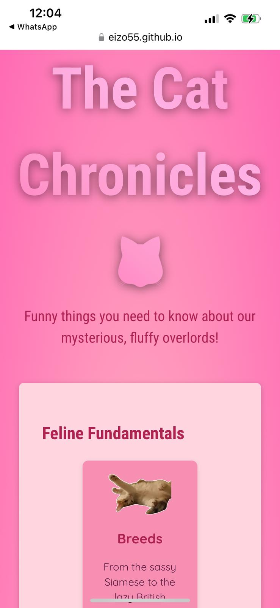

# CatProject
# 🐱 CatProject - Explore the World of Cats! 🐱  

A beautifully designed **cat-themed** web app that introduces different breeds, behaviors, and care tips about cats. This project was built using **React & Vite** and deployed via **GitHub Pages**.  

🔗 **Live Demo:** [CatProject](https://eizo55.github.io/CatProject/)  

---

## 🚀 Features  

✅ **Interactive UI** - Smooth, simple, and easy to navigate  
✅ **Cat Categories** - Explore breeds, behaviors, and care essentials  
✅ **Responsive Design** - Works perfectly on mobile & desktop  
✅ **Fast & Lightweight** - Built using **Vite** for high performance  

---

## 📸 Screenshots  

### 🖥️ Desktop View  
  

### 📱 Mobile View  
  

---

## 🛠️ Installation & Setup  

If you want to run the project locally, follow these steps:  

1️⃣ Clone the repository

```bash
git clone https://github.com/eizo55/CatProject.git
cd CatProject

2️⃣ Install Dependencies

```bash
npm install

3️⃣ Start the Development Server

```bash
npm run dev
Now, open http://localhost:5173/ in your browser.


Project Structure

📁 CatProject
 ┣ 📁 public/         # Static assets (icons, images, etc.)
 ┣ 📁 src/            # Source code
 ┃ ┣ 📁 components/   # React components
 ┃ ┣ 📁 assets/       # Images and assets
 ┃ ┣ 📄 App.jsx       # Main React component
 ┃ ┗ 📄 main.jsx      # Entry point for React
 ┣ 📄 index.html      # Main HTML file
 ┣ 📄 package.json    # Project dependencies
 ┣ 📄 vite.config.js  # Vite configuration
 ┣ 📄 README.md       # Documentation
 ┗ 📁 docs/           # (Optional) Additional documentation

 
Tech Stack
Frontend: React, Vite

Deployment: GitHub Pages

Package Manager: npm

📄 License
This project is licensed under the MIT License. Feel free to use and modify it as you like.

🚀 Happy coding! 😺🎸
.

This README **includes**: project overview, installation and structure.
